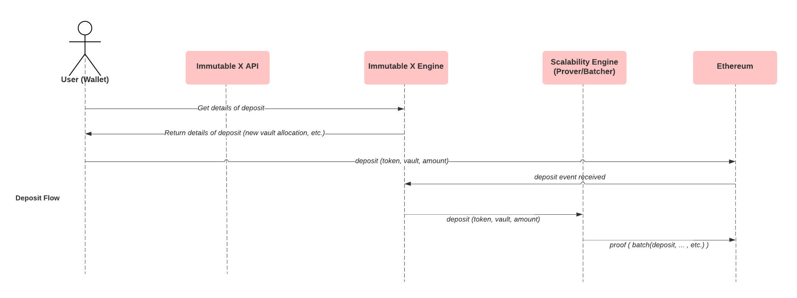

An alternative to L2 minting assets, assuming you have pre minted assets on Ethereum that you'd like to trade on Immutable X, is to deposit them directly.

As a **pre-requisite**, ensure that both the contract and the user depositing has been registered in our system.

The diagram below is a high-level overview of the asset depositing process.

We make 2 client-side calls to abstract much of the unnecessary jargon from you, the call to [Gets details of a signable deposit](ref:post_v1-signable-deposit-details-1) is necessary to query your L2 key given your L1 key, allocate a new vault be it a new asset and convert the asset into an identifier used within our system.

The subsequent call to [deposits](ref:get_v1-deposits-1) on-chain can be done with our client (SDK), this will transfer your asset to our contract which is then offloaded to the Layer 2 allocated vault upon event reception.