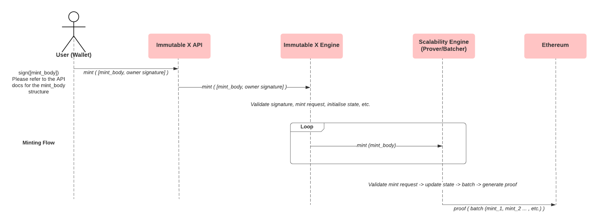

A key advantage of Immutable X is that applications are able to mint assets on Layer 2, rather than minting on Ethereum and then depositing into the exchange. This makes minting gas-free for both applications and users, a massive improvement over the current landscape.  

We are able to do this without the compromises made by other scaling solutions i.e. any assets L2 minted on Immutable X retain L1 (Ethereum)-level security, and can be withdrawn to Ethereum in the next batch. 

# Mintable contracts
If you have an existing smart contract you'd like to mint assets into, you'll need to set up a proxy contract to implement the `mintFor` action and ensure that this proxy contract has the appropriate permissions to mint on your non-mintable ERC-721 contract. Your main contract must adopt a flexible enough permission structure to allow for new 'minter' proxy contracts. 

To update an existing, non-mintable ERC-721 contract, implement the following action:
```solidity
interface IMintable {
    function mintFor(address to, uint256 quantity, bytes mintingBlob); 
}
```

We suggest that you whitelist access to this action to our contract `0x5FDCCA53617f4d2b9134B29090C87D01058e27e9` to ensure no unauthorized executions.

Example smart contracts are available in our [imx-contracts](https://github.com/immutable/imx-contracts) repo. 

For help, [contact support](https://support.immutable.com/hc/en-us/requests/new) to discuss the viability with your existing contract.

# Minting assets
Immutable exposes a minting API. You can mint more than one asset in an API call, and even mint multiple assets to multiple users.

Our metadata crawler will access `<project_metadata_endpoint>/<token_id>` at the time of minting a new token. Please be sure that your endpoint returns a JSON response for each token ID that will be minted.

Here is a high-level overview of the L2 asset minting process:


Here is a [mint tokens](ref:post_v1-mints-1) example:
```json
{
  "mints":
  [{
    "user": "0x...",
    "tokens": [{
      "type": "ERC721",
      "data": {
        "id": "<asset ID>", // custom asset ID (it's possible to make this the ERC-721 token ID depending on the mintable contract implementation)
        "blueprint": "<on-chain metadata>", //note special characters like '<' or '>' cannot be part of the blueprint
        "token_address": "0x..."
      }
    }],
    "auth_signature": "0x..." // signature signed by the contract owner
  }]    
}
```

**NOTE:** Above, `token_address` is the contract address.

Every mint request for a user (for one or many assets) will require an `auth_signature` signed by the contract owner. This ensures that only the entity representing the owner / deployer of the contract will be allowed to authorise mints for users i.e. mint supply is bound by the contract owner's key.

The message digest for the payload is the keccak 256 hash of the stringified mint body payload (without the `auth_signature` field pre-filled)
```json
mintBodyPayload: {"ether_key":"0x5f333ec73a6a851b8cd7a4a450416a966f9bcceb","tokens":[{"type":"ERC721","data":{"id":"10","blueprint":"{onchain-metadata}","token_address":"0x6De6B04D630A4A41bB223815433b9Ebf0da50F69"}}],"auth_signature":""}
```
Below is a snippet of JS code to generate the auth signature using [ethers.js](https://docs.ethers.io/v5/).
```typescript
import * as encUtils from 'enc-utils';
const hash = keccak256(toUtf8Bytes(JSON.stringify(mintBodyPayload)));
const sig = deserializeSignature(await this.signer.signMessage(hash));
return encUtils.addHexPrefix(
  encUtils.padLeft(sig.r.toString(16), 64) +
  encUtils.padLeft(sig.s.toString(16), 64) +
  encUtils.padLeft(sig.recoveryParam?.toString(16) || '', 2),
);
```
Our implementation adopts an all-or-nothing approach, where if any one of our validations fail along the way, we will roll back every previous mint under the scope of a single mint request, to prevent any partial mints.

Once your mint request comes through, you'll be able to trade immediately with your assets.

The withdrawal of a L2-minted asset follows the same process as an on-chain minted asset. See [asset withdrawals](doc:asset-withdrawals) to learn more. 

:::caution Minting with Royalties
NFTs minted using mint v1 will not have royalties. We will only manually add royalties to Ethereum contracts that have implemented mint v1 that are registered before **Thursday 25th of November, 11.59pm AEST**. 

Use mint v2 to ensure that royalties are added to your NFTs.
:::

## Minting throughput
It is preferable to have more mints per minting request instead of more minting requests with less mints per request. It is also advisable to have as less concurrent minting requests as possible. Follow these practices will help you avoid minting request failures due to concurrency and timeout.

In the case of timeout, please retry with some gap in between.

## Token validation
Tokens that are minted on our platform (L2) are validated to ensure they can later be successfully withdrawn to the Ethereum (L1) layer. This validation occurs during the minting process.

If the validation fails, a `mint_unwithdrawable` error code will be thrown. [See error description](https://docs.x.immutable.com/docs/error-codes#mint_unwithdrawable).

## Minting example
Here's and example script to mint tokens in TypeScript:
```typescript
import { AlchemyProvider } from '@ethersproject/providers';
import { Wallet } from '@ethersproject/wallet';
import { ImLogger, WinstonLogger } from '@imtbl/imlogging';
import { ImmutableXClient, MintableERC721TokenType } from '@imtbl/imx-sdk';

import env from './config/client';
import { loggerConfig } from './config/logging';

const provider = new AlchemyProvider('ropsten', env.alchemyApiKey);
const log: ImLogger = new WinstonLogger(loggerConfig);
const component = 'imx-bulk-mint-script';

const waitForTransaction = async (promise: Promise<string>) => {
    const txId = await promise;
    log.info(component, 'Waiting for transaction', {
      txId,
      etherscanLink: `https://ropsten.etherscan.io/tx/${txId}`,
      alchemyLink: `https://dashboard.alchemyapi.io/mempool/eth-ropsten/tx/${txId}`,
    });
    const receipt = await provider.waitForTransaction(txId);
    if (receipt.status === 0) {
      throw new Error('Transaction rejected');
    }
    log.info(component, 'Transaction Mined: ' + receipt.blockNumber);
    return receipt;
};

(async (): Promise<void> => {
    const mintToWallet = '0x....'; // eth wallet public address which will receive the token
    const signer = new Wallet(process.env.PRIVATE_KEY!).connect(provider);

    const minter = await ImmutableXClient.build({
      publicApiUrl: process.env.PUBLIC_API_URL, // https://api.ropsten.x.immutable.com/v1 for ropsten, https://api.x.immutable.com/v1 for mainnet
      signer: signer,
      starkContractAddress: process.env.STARK_CONTRACT_ADDRESS, // 0x4527BE8f31E2ebFbEF4fCADDb5a17447B27d2aef for ropsten, 0x5FDCCA53617f4d2b9134B29090C87D01058e27e9 for mainnet
      registrationContractAddress: process.env.REGISTRATION_CONTRACT_ADDRESS, // 0x6C21EC8DE44AE44D0992ec3e2d9f1aBb6207D864 for ropsten, 0x72a06bf2a1CE5e39cBA06c0CAb824960B587d64c for mainnet
      gasLimit: process.env.GAS_LIMIT,
      gasPrice: process.env.GAS_PRICE,
    });

    log.info(component, 'MINTER REGISTRATION');
    const registerImxResult = await minter.registerImx({
      etherKey: minter.address.toLowerCase(),
      starkPublicKey: minter.starkPublicKey,
    });

    if (registerImxResult.tx_hash === '') {
      log.info(component, 'Minter registered, continuing...');
    } else {
      log.info(component, 'Waiting for minter registration...');
      await waitForTransaction(Promise.resolve(registerImxResult.tx_hash));
    }

    const result = await minter.mint({
      mints: [
        {
          etherKey: mintToWallet.toLowerCase(),
          tokens: [{
            type: MintableERC721TokenType.MINTABLE_ERC721,
            data: {
                tokenAddress: env.tokenAddress, // address of token
                id: '123', // must be a unique uint256 as a string
                blueprint: 'metadata', // metadata can be anything but your L1 contract must parse it on withdrawal from the blueprint format '{tokenId}:{metadata}'
            },
          }],
          nonce: '1',
          authSignature: '', // Leave empty
        },
      ],
    });
    console.log(result);
})().catch((e) => {
    log.error(component, e);
    process.exit(1);
});
```