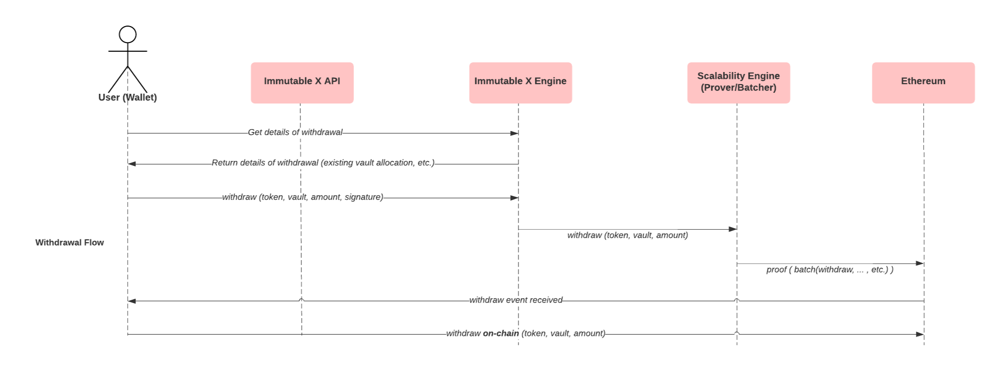

Withdrawals move assets from the off-chain environment to the on-chain environment. Users submit a withdrawal request, then wait for that withdrawal to be included in a batch and published on-chain. After the batch has been published, the user can send a transaction. 

The withdrawal process for both on-chain and L2 minted assets are identical. Below is a high-level overview of the asset withdrawal process.

## Withdrawal process
Withdrawal is a 2-step process: 
- The first call to [gets details of a signable withdrawal](ref:post_v1-signable-withdrawal-details-1) is similar to the get signable details call for an on-chain asset deposit, returning the vault allocated for the asset. 
- The second call to [withdrawal](ref:post_v1-withdrawals-1) will initiate the withdrawal process, post validating the request, submits the withdrawal request to be included in the generation and submission of the next batch.

Upon batch confirmation (on-chain state update), the asset is now available to be withdrawn by the initial owner / originator of the asset. 

In the unlikely case something were to happen to the exchange, we provide the option for users to request for a full withdrawal which will kick off a sequence of events known as a mass exit scenario. The exchange is then given a timeframe, known as a freeze grace period (e.g. 7 days), to service the full withdrawal request. 

Under normal operations of the exchange service, the exchange submits a STARK proof indicating the fulfilment from the vault. Upon acceptance of the proof, the contract adds the withdrawn amount to an on-vault and the full withdrawal request is cleared. You may then withdraw this amount from the on-chain vault back into your account by executing the normal on-chain withdrawal request.

If the exchange fails to service the request (does not submit a valid proof within the given timeframe), the user is entitled to freeze the contract and indicating the vault for which the full withdrawal request has not been serviced. You are then able to obtain a merkle tree path of your vault to be evicted with respect to the frozen vault tree root via our data availability committee (DAC) and submit the proof on-chain. If the proof is valid, the escape is successful and your assets are added to an on-chain vault to be withdrawn only by you.