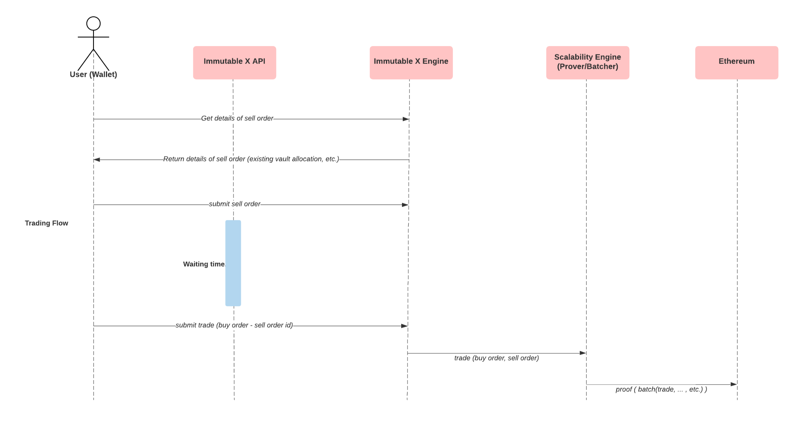

To build a marketplace that supports trading of Immutable X assets, you need to:
- Use our Orderbook APIs to display assets that are currently for sale.
- Use Components to prompt user actions.

If you haven't already, you should also learn about supporting Immutable X assets in your application. See: [Asset Ownership](doc:asset-ownership). 
## Central Orderbook

To help facilitate liquidity, Immutable maintains a central orderbook which can be immediately accessed by any application via our API. Adding your orders to this book will enable them to be filled by any other client application, improving your likelihood of being able to capture fees from these orders.

The APIs for this orderbook are as follows:

- [Get Orders](ref:get_v1-orders-1) 
- [Get Order](ref:get_v1-orders-id-1) 
- [Create Order](ref:post_v1-orders-1)
- [Cancel Order](ref:delete_v1-orders-id-1)

Currently, Immutable X doesn't support updating existing orders, only cancellation and replacement.
:::info Expiration timestamp format
When passing in a expiration_timestamp to the Orders API as part of a Post call you will need to convert the time to a Unix timestamp.

The Unix epoch (or Unix time or POSIX time or Unix timestamp) is the number of seconds that have elapsed since January 1, 1970 (midnight UTC/GMT), not counting leap seconds (in ISO 8601: 1970-01-01T00:00:00Z). Literally speaking, the epoch is Unix time 0 (midnight 1/1/1970), but 'epoch' is often used as a synonym for Unix time. Some systems store epoch dates as a signed 32-bit integer, which might cause problems on January 19, 2038 (known as the Year 2038 problem or Y2038). The converter on this page converts timestamps in seconds (10-digit), milliseconds (13-digit) and microseconds (16-digit) to readable dates.
:::

## Submitting Trades

If you have matched two orders on L2, you can submit those directly to the API using the [Create Trade](ref:post_v1-trades-1) endpoint. Note that these trades must still be signed by the relevant users.

## Immutable Components

Immutable X allows users to keep their existing Ethereum wallet: no installations, upgrades or changes required. 

To ensure that users are able to sign trades which can be processed by Immutable X, and to ensure that applications display the correct assets to users and provide them with informed consent, Immutable provides a bridging service called **Immutable Components**. This service uses a signed security string to derive a STARK-friendly Immutable X key, which the user will use to sign L2 interactions. This ensures that users can always recover assets as long as they retain access to their Ethereum wallet. 

Immutable Components is a separate web application, now with iframe support [more information here](https://docs.x.immutable.com/docs/components-iframe-support). All StarkEx-specific Immutable X interactions are abstracted away from your marketplace and into Immutable Components.

Immutable Components will soon be open source and made publicly available.

## Components
Immutable provides a convenient interface for initiating Immutable Components actions in the form of a Typescript SDK. To install the SDK in your project, use:
```bash title="SDK Installation"
npm install @imtbl/imx-components
```

This SDK allows users to prompt the Immutable Components window using a simple set of Typescript functions (draft interface presented below):
```typescript title="SDK Interface"
interface ETH {
    amount: string; 
}

interface ERC20 {
    contract: string;
  amount: string;
}

interface ERC721 {
    contract: string;
    token_id: string;
}

type Asset = ETH | ERC20 | ERC721;

interface Order {
  user: string;
  buy: Asset;
  sell: Asset;
}

interface ETHTxResponse {
  rejectedSignature: boolean;
  rejectedLink: boolean;
  txhash: string;
}

interface ImXTxResponse {
    id: string; 
  success: boolean;
}
 
class Components {    
  public deposit(user: string, assets: Array<Asset>): Promise<ETHTxResponse>;
  public withdraw(user: string, assets: Array<Asset>): Promise<ETHTxResponse>;
  public transfer(user: string, to: string, assets: Array<Asset>): Promise<ImXTxReponse>;
  public fill(user: string, orderIDs: Array<string>): Promise<ImXTxReponse>;
  public order(user: string, orders: Array<Order>, broadcast = true): Promise<ImXTxReponse>;
}
```

A high-level overview of the trading process is as follows.


## Example

To help understand how this works, consider a marketplace for Axies:

First, the marketplace uses the [get orders](ref:get_v1-orders-1) endpoint to load a list of active orders. Our buyer decides to buy a Mystic Axie for 3 ETH. The marketplace uses the [Components](doc:components) to prompt the Components. 

Components will then use the [get order details](ref:get_v1-orders-id-1) endpoint to get the required parameters for the user to sign. The user will sign the order, and the Components will use the [submit order](ref:post_v1-orders-1) endpoint to send it to Immutable X. 

The exchange then confirms or rejects the trade, and notifies Components, which will send an `ImXTxResponse` back to the marketplace, which can display the success or failure of the trade to the user. The asset will be *immediately* available for trading or use within Axie Infinity, provided they [support asset ownership](doc:supporting-assets-in-your-application).

## Frequently Asked Questions

*1. Is there an auction flow functionality?*

Currently, the auction flow functionality is not supported yet. It will be coming later.

*2. What happens when a trade happens on Immutable? Is there a callback sent to our servers to adjust our application inventory?*

At the moment, we recommend polling our /mints, /transfers and /trades APIs at regular intervals - we'll likely set up webhooks/sockets in future.

*3. How do we ensure the Smart Contract is utilised whenever the NFT is traded?* 

To ensure this, you will need to ban direct transferring from user to user. Best way to combat this is providing the best place to trade and ensuring it’s within Immutable X.