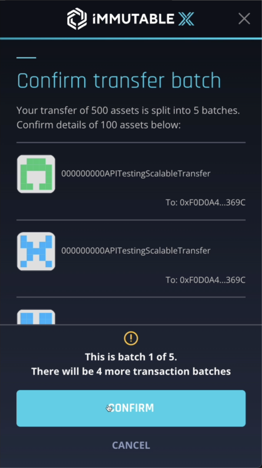
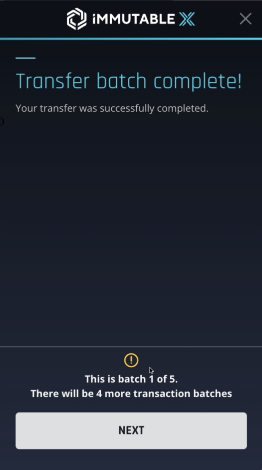
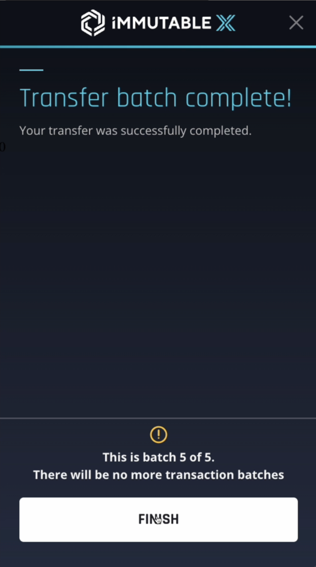
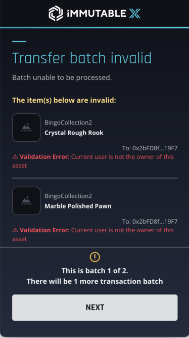

As of `1.3.52`, the `@imtbl/imx-sdk` supports transferring large amounts of NFT assets in batches. To begin a new batch transfer flow, link should be called like so:

```javascript
const response = await link.batchNftTransfer(payload)
```

Where the payload is of type `LinkParams.BatchNftTransfer`:

```typescript
const payload: LinkParams.BatchNftTransfer = [
  {
    type: ERC721TokenType.ERC721, // Must be of type ERC721
    tokenId: string, // the token ID
    tokenAddress: string, // the collection address / contract address this token belongs to
    toAddress: string, // the wallet address this token is being transferred to
  },
  //...remainingTransfers
]
```

The response type will be identical to that of the [existing transfers](https://docs.x.immutable.com/docs/linktransfer).

## Notes

- Requests will be batched in groups of **100** (This is the current batch size, it is subject to change, however this will not affect your implementation)

- Only tokens of type `ERC721TokenType.ERC721` can be used in `link.batchNftTransfer`

- If any validation errors are present in the current batch, the entire batch will not be performed

- If any API errors are received as part of processing the current batch, the entire batch will fail

- If any errors are present (due to validation, API or otherwise) for a particular batch, you will still be able progress to the next batch

- Each confirmation is accompanied by a signing process on the user wallet

## Screenshots from user journey

import useBaseUrl from '@docusaurus/useBaseUrl';








