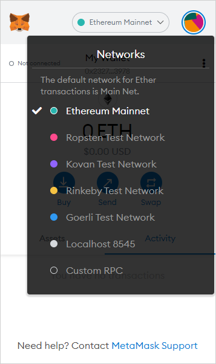
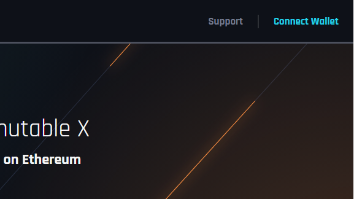
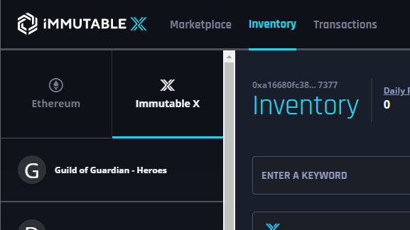
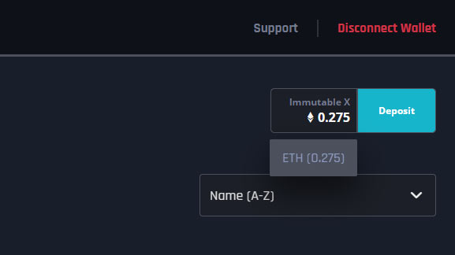
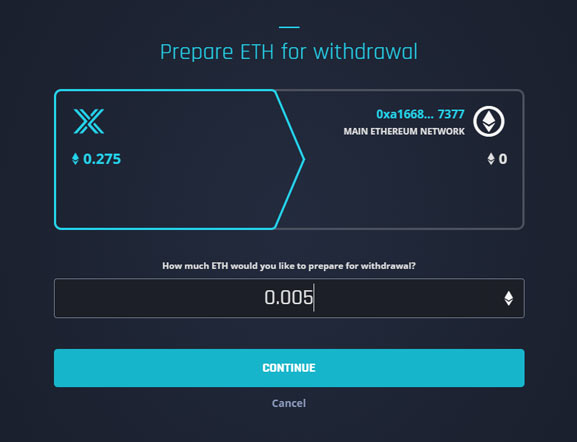
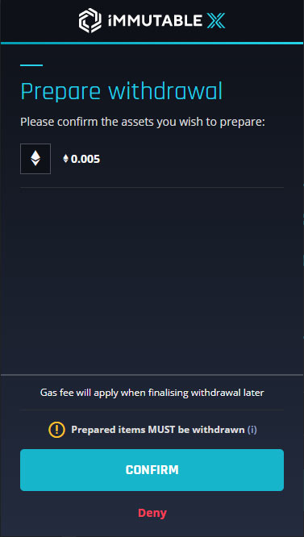
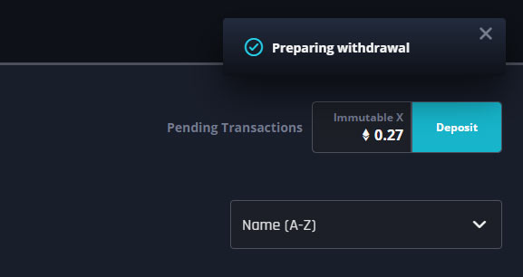
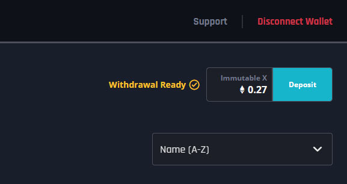
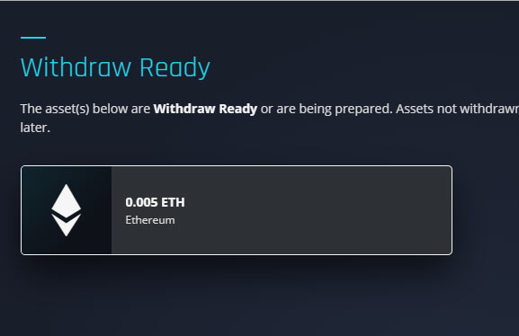
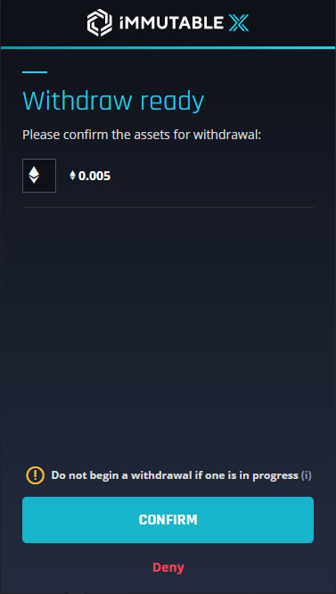

To withdraw your funds from Immutable X (Layer 2), you can do so via the API or Immutable X Marketplace.

## Steps to Withdraw via Immutable X Marketplace
1. Go to the [Immutable X Marketplace](https://market.x.immutable.com).
2. Connect wallet on Ethereum mainnet.

3. Go to your inventory page.

4. Click on "Immutable X" balance next to the deposit button on the far right.

5. Select either ETH or the ERC-20 token you would like to withdraw.
6. Specify the amount and hit continue to follow the Components process to sign the transaction. This will prepare your withdrawal from Layer 2 to Layer 1.

7. After some time (currently around 12 hours), your withdrawal should be ready to be taken onto Layer 1. At this point if you go back into the Immutable X Marketplace, you should see "preparing withdrawal" change to "withdrawal ready".

8. Click on "withdrawal ready" and select ETH or the ERC-20 token you would like to withdraw to Layer 1.

9. Follow the confirmation process in Components.

10. Your balance should show in your Layer 1 wallet soon (currently around 12 hours). There is a delay because we  batch transactions and send a single proof on-chain to reduce gas costs.